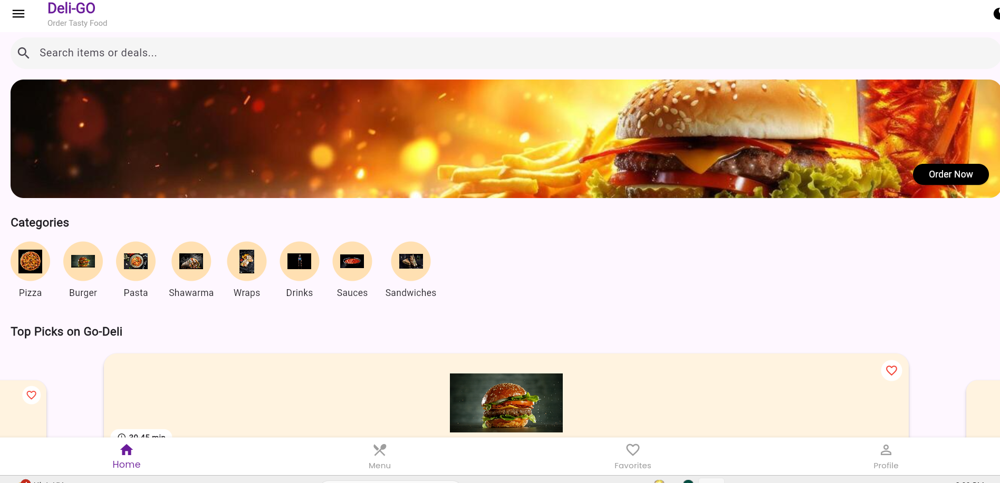
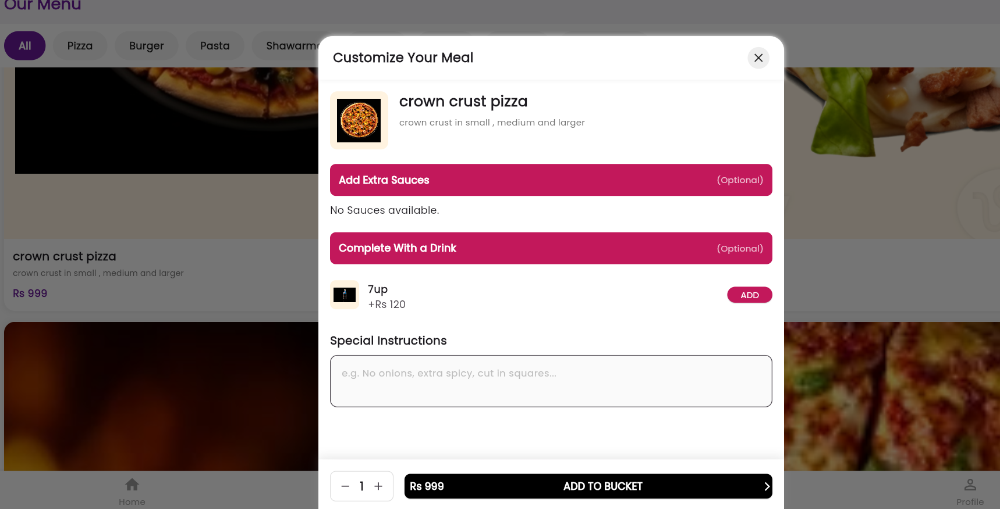
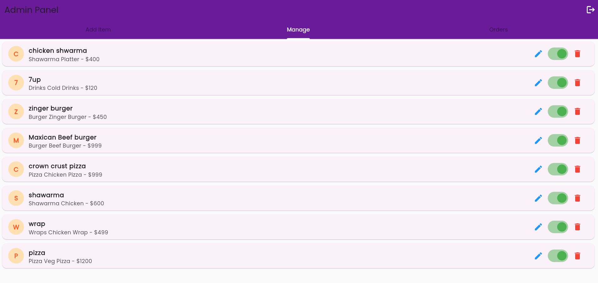
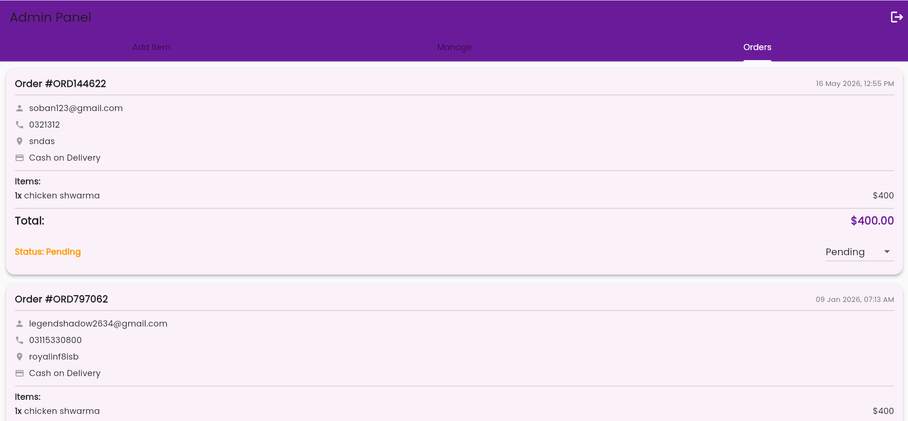

# 🍽️ ForkLane — Food Delivery App

ForkLane is a cross-platform food delivery application built with **Flutter** and **Firebase**, featuring separate experiences for customers and administrators. It's designed as a complete, end-to-end ordering system — from browsing the menu to tracking an order in real time.

---

## ✨ Features

### Customer Panel
- User authentication (sign up / login)
- Browse menu with categorized food items
- Product customization (add-ons, quantity, etc.)
- Cart management with live total calculation
- Favorites list
- Checkout flow with order summary
- Order history and real-time order tracking
- User profile management

### Admin Panel
- Admin authentication
- Add, edit, and manage menu items
- Order management dashboard
- Real-time order status updates

---

## 🛠️ Tech Stack

| Category | Technology |
|---|---|
| Framework | Flutter |
| State Management | Provider |
| Backend / Database | Firebase (Firestore, Realtime Database) |
| Authentication | Firebase Auth |
| Fonts | Google Fonts (Poppins) |
| UI Extras | Carousel Slider, Lottie Animations |

---
## 📱 Screenshots

|  |  |
|---|---|
|  |  |

## 🚀 Getting Started

### Prerequisites
- [Flutter SDK](https://docs.flutter.dev/get-started/install) installed and added to PATH
- A Firebase project (Firestore, Authentication, and Realtime Database enabled)

### Setup

1. **Clone the repository**
   ```bash
   git clone https://github.com/<your-username>/ForkLane-Food-Delivery-App.git
   cd ForkLane-Food-Delivery-App
   ```

2. **Install dependencies**
   ```bash
   flutter pub get
   ```

3. **Connect your own Firebase project**

   This repo does not include Firebase configuration files (`google-services.json`, `firebase_options.dart`) for security reasons. Generate your own using the FlutterFire CLI:
   ```bash
   dart pub global activate flutterfire_cli
   flutterfire configure
   ```

4. **Run the app**
   ```bash
   flutter run -d chrome
   ```
   (or run on an emulator / physical device of your choice)

---

## 📂 Project Structure

```
lib/
├── models/               # Data models
├── panals/
│   ├── admin/            # Admin-side screens
│   └── customers panal/  # Customer-side screens
├── provider/              # Favorites state management
├── providers/              # Cart state management
└── main.dart              # App entry point
```

---

## 📄 License

This project is open for educational and portfolio purposes.